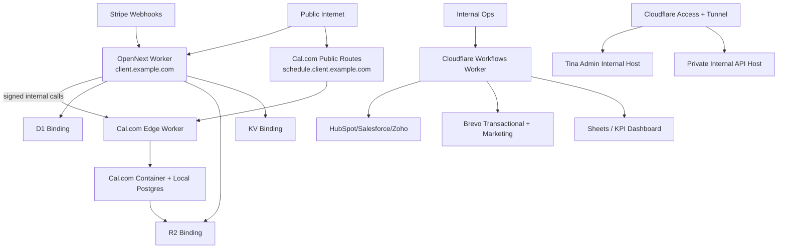

# Per-client Cloudflare Isolation Template

This template implements Option A for this repository's stack:

- OpenNext (public frontend)
- TinaCMS admin (private by default)
- Stripe webhooks (public, tightly scoped)
- Cal.com in Cloudflare Containers (public scheduler routes only)
- Cloudflare Workflows worker (private automation runtime)
- D1, R2, KV (private via bindings)
- Cal.com PostgreSQL (container-local only)

## Architecture sketch



## Tier Packaging (Template)

| Tier | Target setup window | Includes | Microsoft Clarity |
| --- | --- | --- | --- |
| Basic | 3-4 hours | Branded site (3 pages), contact capture, Cal.com booking, basic AI FAQ chat | Not included |
| Growth | 4-6 hours | Basic + lead/booking automations, Brevo nurture sequence, review workflow | Included |
| Pro | 6-8 hours | Growth + full Cloudflare Workflow automation pack, CRM sync, KPI pipeline, advanced AI options | Included |

Policy: all tiers except `basic` require `NEXT_PUBLIC_MICROSOFT_CLARITY_PROJECT_ID`.

## Pro Tier (One-day Deployable)

Visible deliverables:

1. Marketing site (3-5 pages) with brand swap in under 1 hour.
2. Cal.com self-hosted booking with optional deposit capture.
3. AI chat widget for FAQ + lead pre-qualification.
4. Automated follow-ups over email and SMS.
5. Review request flows after appointments.
6. Lightweight analytics and reporting with Clarity + KPI sheets.

Invisible ROI engine (Cloudflare Workflows):

1. New lead workflow: instant owner alert, CRM create/update, KPI logging.
2. Booking confirmation + reminders: immediate confirmation, 24h and 1h reminders.
3. Review and reputation workflow: post-service email/SMS nudges and team alerts.
4. Lead nurture workflow: multi-step sequence when no booking after 24-48h.
5. Optional team sync workflow: Slack notification on critical lead milestones.

## Pro-only Workflow Catalog

Prebuilt templates are designed for clone-and-configure deployment:

1. Lead scoring and tagging (`lead-scoring-and-tagging`).
2. Multi-channel follow-up sequencer (`multi-channel-follow-up-sequencer`).
3. Upsell or cross-sell suggestions (`upsell-cross-sell-suggestions`).
4. Review aggregation and posting (`review-aggregation-and-posting`).
5. Deposit or payment follow-up (`payment-deposit-follow-up`).
6. Lost lead recovery sequence (`lost-lead-recovery`).
7. Event or webinar reminders (`event-webinar-reminders`).
8. VIP/high-value lead notifications (`vip-high-value-lead-alerts`).
9. Abandoned form recovery (`abandoned-form-recovery`).
10. Loyalty/repeat client automation (`loyalty-repeat-client-automation`).
11. Geo-targeted promotions (`geo-targeted-promotions`).
12. Internal KPI dashboard sync (`internal-kpi-dashboard-sync`).

These IDs are dispatched through `cloudflare/workflows/src/worker.ts` via `POST /automation/dispatch`.

## Email and SMS Standard

All outbound contact, nurture, reminder, and review traffic is standardized on Brevo:

- Transactional email: Brevo SMTP/API.
- Marketing email: Brevo lists/campaign endpoints.
- SMS: Brevo transactional SMS via `/integrations/brevo/sms`.
- Email template rendering: React Email templates from this repo.

Required baseline secrets:

- `BREVO_API_KEY`
- `BREVO_FROM_EMAIL`
- `BREVO_FROM_NAME` (recommended)
- `BREVO_SMS_SENDER`
- `BREVO_SMS_WEBHOOK_TOKEN`

## CRM Integrations (Top 3 Marketshare)

The template supports these CRM targets out of the box:

1. HubSpot
2. Salesforce
3. Zoho CRM

Required runtime selector:

- `CRM_PROVIDER=hubspot|salesforce|zoho`

Credential placeholders are scaffolded to per-client env templates generated by `scripts/cf-client-init.sh`.

## Optional Add-ons (Template Pricing)

1. Extra pages: `$20 / month per page`
2. SEO optimization (manual process): `$99 / month`
3. AI autoblogger (Gemini): `$49 / month`
   - Model default: `gemini-3-flash`
4. Advanced AI chatbot (Cloudflare AI Search with overage): `$79 / month`

## 1) Generate a client scaffold

From repository root:

```bash
scripts/cf-client-init.sh <client-slug> <public-hostname> [internal-zone]
```

Example:

```bash
scripts/cf-client-init.sh client1 client1.example.com internal.example.com
```

This creates:

- `cloudflare/clients/<client-slug>/wrangler.site.jsonc`
- `cloudflare/clients/<client-slug>/wrangler.calcom.toml`
- `cloudflare/clients/<client-slug>/provision.sh`
- `cloudflare/clients/<client-slug>/topology.md`
- `cloudflare/clients/<client-slug>/security.auto.env.example`
- `cloudflare/clients/<client-slug>/service-packages.json`
- `cloudflare/clients/<client-slug>/cloudflare-workflow-catalog.json`
- `cloudflare/clients/<client-slug>/automation.env.example`

## 2) Resource and routing defaults

Public:

- `https://<public-hostname>` OpenNext frontend
- Optional `https://schedule.<public-hostname>` Cal.com public scheduling
- `https://<public-hostname>/api/stripe/webhook` Stripe callback

Private:

- `https://api-<slug>.<internal-zone>` internal API
- `https://cal-<slug>.<internal-zone>` Cal.com private/API traffic
- `https://admin-<slug>.<internal-zone>` Tina admin
- D1, R2, KV only through Worker bindings

## 3) Deploy sequence

1. Create D1/KV/R2 resources.
2. Build OpenNext output with `pnpm run cf:build`.
3. Deploy the site worker and Cal.com worker with the generated Wrangler configs.
4. Add `CALCOM_INTERNAL_API_TOKEN` to both workers (site + Cal.com).
5. Add remaining secrets to the per-client Cal.com worker.
6. Optional for Stripe appointment deposits: run `ENABLE_CALCOM_STRIPE_DEPOSITS=1 cloudflare/clients/<client-slug>/provision.sh` to set Stripe keys on the Cal.com worker.
7. Create DNS routes.
8. Run API-driven Access/WAF automation.

The generated `provision.sh` script includes command scaffolding for steps 1-8.

## 4) OpenNext signed Cal.com helper

Use `src/lib/calcom-internal-client.ts` for server-side calls from OpenNext:

- Requires `CALCOM_INTERNAL_BASE_URL` (plain var)
- Requires `CALCOM_INTERNAL_API_TOKEN` (secret)
- Injects `Authorization: Bearer <CALCOM_INTERNAL_API_TOKEN>` automatically

## 5) Cal.com endpoint isolation

`cloudflare/container/src/worker.ts` supports strict route policy:

- Enable with `CALCOM_ROUTE_POLICY_ENABLED=true`
- Define public paths with `CALCOM_PUBLIC_ROUTE_RULES`
- Include Stripe payment callback/webhook paths (for deposits): `/api/integrations/stripepayment/*` and `/api/stripe/webhook`
- Require `CALCOM_INTERNAL_API_TOKEN` for all non-public routes

This keeps only booking/scheduling endpoints public while forcing signed/internal auth for all other Cal.com routes.

## 6) API-driven Access/WAF automation

Run:

```bash
APPLY_CF_SECURITY=1 \
ACCESS_ALLOW_EMAILS="admin@example.com" \
STRIPE_IP_CIDRS="3.18.12.63/32,3.130.192.231/32" \
cloudflare/clients/<client-slug>/provision.sh
```

Or call directly:

```bash
scripts/cf-client-security-provision.sh <client-slug> <public-hostname> [internal-zone]
```

What it provisions automatically:

- Cloudflare Access apps/policies for internal hosts (`admin-`, `api-`, `cal-`)
- WAF block rules for:
  - `/_ops/*` on the public site host
  - non-`POST` requests to `/api/stripe/webhook`
  - optional Stripe IP allowlist enforcement on `/api/stripe/webhook`
  - non-public Cal.com routes on `schedule.<public-hostname>`

## 7) Required manual controls

- Validate DNS routing before turning on Access enforcement.
- Keep Stripe CIDR list current if you enable strict webhook IP allowlist.
- Per-client separation of D1 DB, KV namespace, and R2 buckets.
- Keep automation credentials scoped per client for Brevo + CRM connectors.
